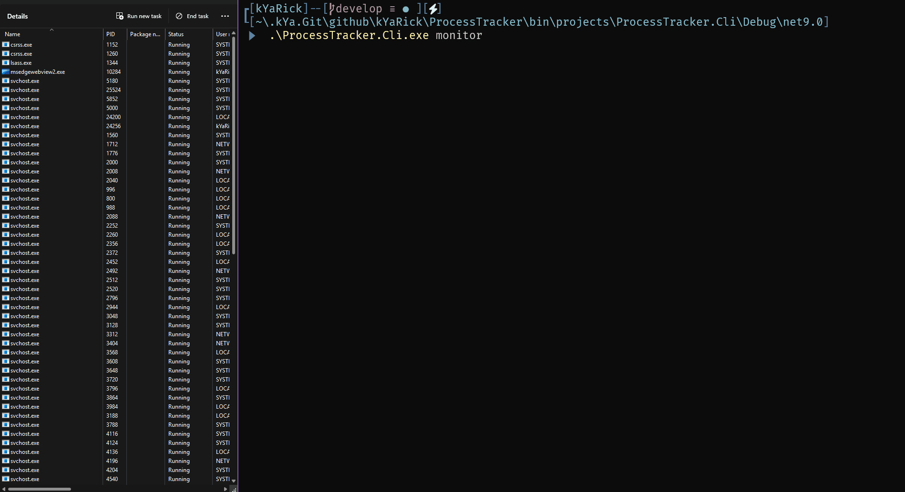

# ⏲️ ProcessTracker


[](https://github.com/dotnet)
[](https://spectreconsole.net/)
[](#)
[](LICENSE)
[](https://github.com/nikit0ns/Ukrainian_IT_Communities)


<div align="center">
  
  <br>
  
</div>

## 🚀 Overview

ProcessTracker is a lightweight utility born out of necessity to solve the "orphaned process" problem. 🧟‍♂️ When applications working with COM objects (like Microsoft Word, Excel) crash or close unexpectedly, they often leave behind orphaned processes consuming system resources... because apparently, proper process management is optional these days. 🙄

This tool *forcefully* terminates these stubborn processes (or no 🌚), keeping your system clean and efficient. 🔫💥 Built with equal parts desperation, StackOverflow wisdom, and a generous helping of ChatGPT consultations. Because sometimes you need to take process management into your own hands!🤌

## ✨ Key Features 

- **Process Relationship Tracking**: Link parent and child processes
- **Automatic Cleanup**: Terminate orphaned processes when parent applications exit
- **Flexible Monitoring**: Configure monitoring intervals and auto-exit timeouts
- **Simple CLI Interface**: Easy-to-use command line tools

## 🌈 Features

- Process discovery and monitoring
- Detailed process information collection
- Configuration management via JSON
- Command-line interface for easy interaction
- Cross-platform compatibility (primarily Windows)

## 📋 Usage

```ps
proctrack [OPTIONS] <COMMAND>
```

### 💭 Commands

| Command | Description | Example |
|---------|-------------|---------|
| `add` 🔗 | Add a process pair to track | `proctrack add --main 1234 --child 5678` |
| `remove` ✂️ | Remove a process pair from tracking | `proctrack remove --main 1234 --child 5678` |
| `list` 📋 | List all tracked process pairs | `proctrack list` |
| `clear` 🧹 | Clear all tracked process pairs | `proctrack clear` |
| `monitor` 👁️ | Start monitoring mode with live updates | `proctrack monitor --interval 5 --auto-exit 60` |
| `stop` 🛑 | Stop the background monitor process | `proctrack stop` |
| `snapshot` 📸 | Take snapshots of processes and manage them | `proctrack snapshot --process WINWORD --before` |
| `test`* 🧪 | Create and monitor a test process pair | `proctrack test` |

> [!NOTE]  
> The `test` command is only available in Debug builds.

### 🪄 Examples

Monitor with 5-second intervals and auto-exit after 60 seconds:
```ps
.\ProcessTracker.Cli.exe monitor `
--interval 5 `
--auto-exit 60
```

Track Word processes launched by your application:
```ps
.\ProcessTracker.Cli.exe `
add `
--main $YourAppPID `
--child $WordPID`
&& `
.\ProcessTracker.Cli.exe monitor
```

## 📸 Using the Snapshot Command

The `snapshot` command helps with tracking processes created during operations and cleaning them up afterward. This is especially useful for applications like Microsoft Office that may leave behind orphaned processes.

### How it works:

1. **Before** mode captures the currently running processes with a specific name
2. **After** mode detects any new processes with the same name and terminates them

### Options:

- `--process` / `-p`: Specifies the process name to track (e.g., 'WINWORD', 'EXCEL')
- `--before`: Takes a snapshot of processes before an operation
- `--after`: Takes a snapshot after an operation and terminates new instances
- `--quiet` / `-q`: Suppresses detailed output

### Common Use Cases:

- Cleaning up Word, Excel, or PowerPoint processes after automation tasks
- Finding and terminating background processes left behind by applications
- Testing applications to identify process leaks

## Project Structure 🏗️

- **ProcessTracker**: Core library containing the monitoring functionality
- **ProcessTracker.Cli**: Command-line interface for interacting with the system
- **ConfigRunner**: Configuration management utility

## Contributing 🤝

Contributions are welcome! Feel free to submit a Pull Request or open an Issue.

1. Fork the repository
2. Create your feature branch (`git checkout -b feature/amazing-feature`)
3. Commit your changes (`git commit -m 'Add some amazing feature'`)
4. Push to the branch (`git push origin feature/amazing-feature`)
5. Open a Pull Request

## License 📄

This project is licensed under the MIT License - see the [license](LICENSE) file for details.

---

### 💙💛 Made with love in Ukraine 💙💛

This project is developed with pride in Ukraine.  
In these challenging times, Ukrainian developers continue to create and innovate.  
Your support means the world to us.

*"Code like resilience and language matters"*
